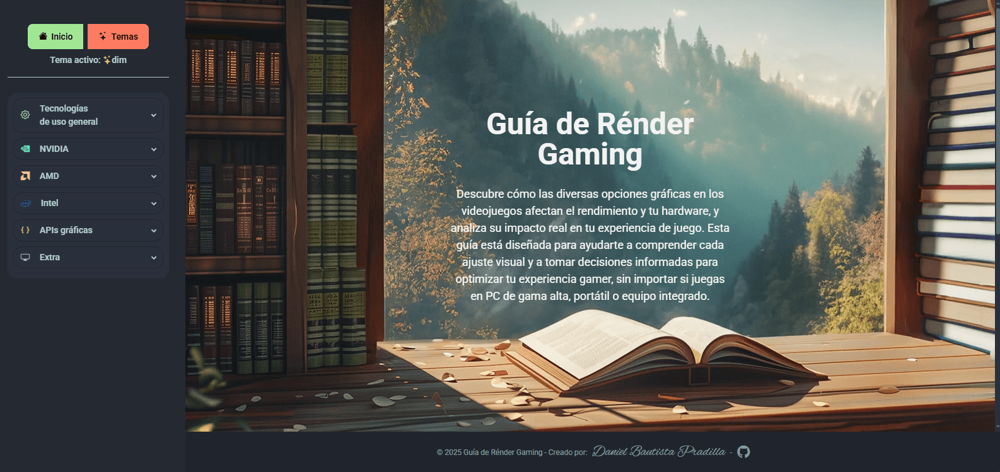

# Guía de Rénder Gaming

Descubre cómo las diversas opciones gráficas en los videojuegos afectan el rendimiento y tu hardware, y
analiza su impacto real en tu experiencia de juego.

# Dirección web

[Guía de Rénder Gaming](https://guiarendergaming.pages.dev/)

## Imágenes del proyecto

- **Vista general:**
  

## Estructura del Proyecto

```text
├── AGENTS.MD              # Guía de prompts e instrucciones para IA
├── README.md              # Documentación principal del proyecto
├── package.json           # Dependencias y scripts de npm
├── astro.config.mjs       # Configuración de Astro
├── tsconfig.json          # Configuración de TypeScript
├── LICENSE                # Licencia del proyecto
│
├── public/                # Archivos estáticos (se sirven tal cual)
│   ├── favicon.svg
│   ├── intel_icon.svg
│   ├── fonts/             # Tipografías (Roboto, AlexBrush, etc.)
│   ├── img/               # Imágenes generales y por tecnología
│   └── video/             # Videos usados en la guía
│
├── src/                   # Código fuente principal
│   ├── assets/            # Recursos como CSS y gráficos base
│   ├── components/        # Componentes Astro reutilizables
│   ├── data/              # Datos estáticos (índices, listas, etc.)
│   ├── layouts/           # Plantillas de diseño (ej. Dashboard)
│   └── pages/             # Páginas del sitio
│       ├── general/       # Opciones gráficas comunes
│       ├── nvidia/        # Tecnologías propietarias NVIDIA
│       ├── amd/           # Tecnologías propietarias AMD
│       ├── intel/         # Tecnologías propietarias Intel
│       ├── apis/          # APIs gráficas (DirectX, Vulkan, etc.)
│       ├── extra/         # Secciones adicionales (referencias, display)
│       ├── index.astro    # Página principal
│       └── temas.astro    # Índice temático
```
