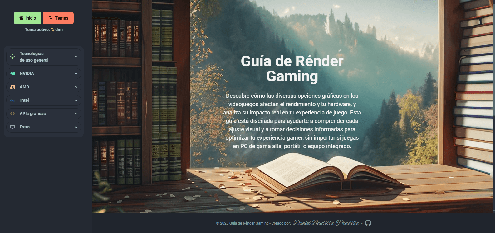
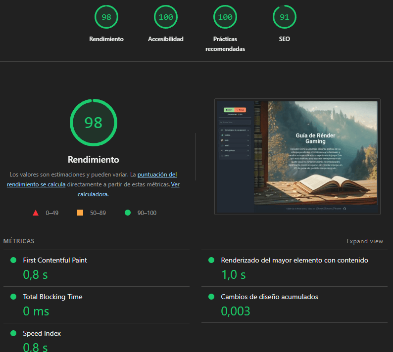

# Guía de Rénder Gaming

> Analiza opciones gráficas en videojuegos, su impacto real en tu hardware y optimiza tu experiencia gamer sin importar si juegas en PC de gama alta, portátil o equipo integrado.

**[Ver la guía en línea](https://guiarendergaming.pages.dev/)**

## Características

- **Imágenes comparativas** — En cada sección encontrarás ejemplos visuales que muestran cómo cambian los gráficos al modificar configuraciones como sombras, texturas, antialiasing o reflejos.
- **Fácil de entender** — La guía está escrita en un lenguaje sencillo, sin tecnicismos innecesarios. Aprenderás paso a paso qué significa cada parámetro y cómo impacta en la fluidez.
- **Organizado por tecnología y fabricantes** — El contenido está estructurado por categorías: configuraciones generales, tecnologías gráficas y recomendaciones específicas por fabricante.

## Contenido cubierto

| Categoría         | Temas | Ejemplos                                                                 |
| ----------------- | ----- | ------------------------------------------------------------------------ |
| **General**       | 21    | Sombras, texturas, antialiasing, VSync, profundidad de campo, bloom...   |
| **NVIDIA**        | 8     | DLSS, DLAA, HairWorks, NIS, PhysX, Reflex, FaceWorks, Freestyle          |
| **AMD**           | 6     | FSR, FidelityFX Suite, RIS, RSR, Anti-Lag, TressFX Hair                  |
| **Intel**         | 5     | XeSS, Integer Scaling, XeSS FG, Low Latency Mode, Xe Adaptive Sharpening |
| **APIs gráficas** | 4     | DirectX, Vulkan, OpenGL, Metal                                           |
| **Extra**         | 4     | Monitores, referencias, cuadro comparativo, guía de ventiladores         |

## Stack tecnológico

- [Astro](https://astro.build/) — Framework estático para sitios web rápidos
- [Tailwind CSS](https://tailwindcss.com/) — Framework CSS utility-first
- [DaisyUI](https://daisyui.com/) — Componentes para Tailwind CSS
- [Bootstrap Icons](https://icons.getbootstrap.com/) — Iconografía

## Ejecutar localmente

```bash
# Instalar dependencias (requiere pnpm)
pnpm install

# Iniciar servidor de desarrollo
pnpm dev
```

## Imágenes del proyecto

**Vista general:**


**Optimización:**

